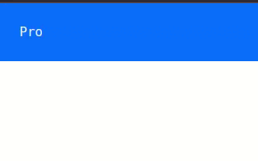

# Frontend Tricks
Autor: [Angelo Osorio](https://twitter.com/Engel_PAIN)

## Información relevante y datos sobre diseño
* [Resoluciones de monitores y display de dispositivos más usados](./datos/resoluciones.md).
* [Breakpoints de bootstrap](./datos/media-queries.md).

## Trucos de HTML5
* [Lazy loading](./html/README.md#lazy-loading)
* [Sugerencias en el input](./html/README.md#sugerencias-en-el-input)
* [Base URL](./html/README.md#base-url)

## Trucos en CSS3 y Sass
* [Type Effect](./typeffect/readme.md): Efecto de letras escribiéndose automáticamente.

## Minilibrerías de estilos escritas en Sass
* [Radios personalizados](./radios/radios.md)
* [Transiciones con css3](./transition/README.md)
