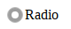
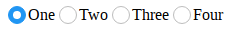
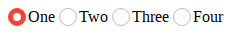
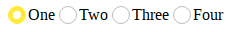
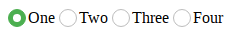
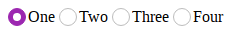
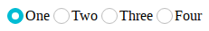

# Guía de uso
Autor: [Angelo Osorio](https://twitter.com/Engel_PAIN) <br>
Fecha de Elaboración: 05-01-2018 (dd,mm,aaaa)

## Utilización
1. Crear un **label** con class *radio-group*.
2. Dentro del **label** agregar un input y un **span** vacío.
3. Al **span** vacío agregarle el class *radio-group*.

El código final sería este:
```html
<label class="radio-group">
  Radio
  <input type="radio" checked>
  <span class="checkmark"></span>
</label>
```
Y se verá así: <br>


## Variantes
Para usar las variantes disponibles se agrega una etiqueta que envuelva todo el
conjunto de radios y se agrega la clase *-radio, donde * son las siguientes
variables disponibles:

### blue-radio
```html
<p class="blue-radio">
  <label class="radio-group">One
    <input type="radio" name="radiob" checked>
    <span class="checkmark"></span>
  </label>

  <label class="radio-group">Two
    <input type="radio" name="radiob">
    <span class="checkmark"></span>
  </label>
</p>
```


### red-radio
```html
<p class="red-radio">
  ...
</p>
```


### yellow-radio
```html
<p class="yellow-radio">
  ...
</p>
```


### green-radio
```html
<p class="green-radio">
  ...
</p>
```


### violet-radio
```html
<p class="violet-radio">
  ...
</p>
```


### cyan-radio
```html
<p class="cyan-radio">
  ...
</p>
```

